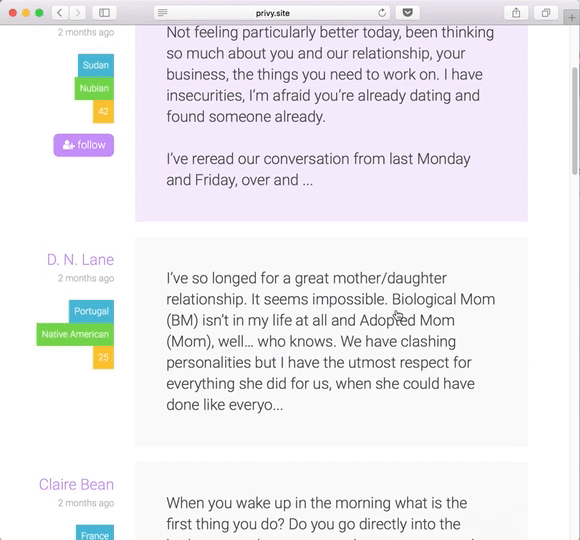
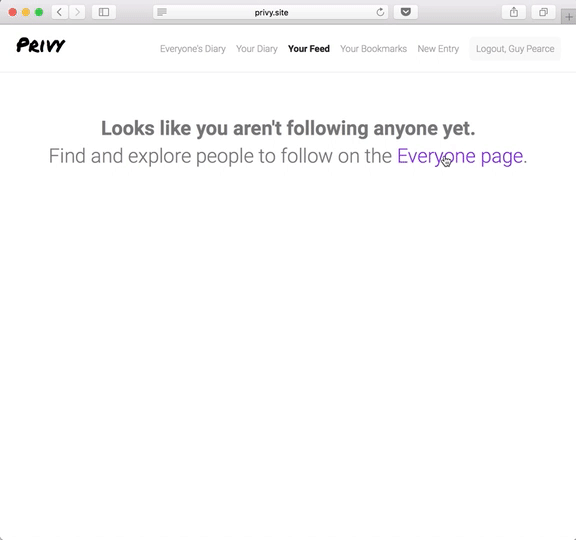

# Privy 
[Privy][live-link] is a single page, full-stack application that lets users publish an anonymous diary under a pseudonym.

The application is implemented via an MVC (Model-View-Controller) design pattern. The Ruby on Rails framework is responsible for the model to retrieve data from a PostgreSQL database and is also responsible for the controller to construct a RESTful JSON API response.

React is responsible for rendering the Views based off of HTTP JSON response generated by Rails. The React frontend is also paired with a Redux flux architecture to manage state and ensure unidirectional data flow.

Privy is passion project born out of my own curiosity about how other people think and experience life, and out of a desire publish my own experiences for others to read.

[Check out Privy live ->][live-link]


## Features
  * Secure account login authentication and creation: passwords are hashed and salted via BCrypt on the backend, additional reinforced protection is provided on the frontend via protected routes in React.
  * Users can follow and read other people’s published diaries.
  * Users can save and bookmark diary entries to reference to later.
  * Users can post a reflection on an old entry they've written. (Note: Privy is intentionally designed so that users cannot post reflections for entries that aren't theirs.)

## Previews of Privy in action
### Browsing Entries


### Following Users


### Writing a personal reflection


### Deleting and Editing Diary Entries


 ### Login and Greeting page
  

## Code Highlights
 ### Viewing posts
To maintain DRY code, the same React component was used to render three different index views: the personal feed (showing entries based on a user's followers), others users' entries (all entries writen by one user), the user's own entries.

This was made possible by checking the URL pathname and using conditional case statements to render specific content for specific index cases.
```
  showEmptyActions() {
    const { pathname } = this.props;
    switch (pathname) {
      case '/feed':
        return (
          <span>
            <strong>Looks like you aren't following anyone yet.</strong><br />
            Find and explore people to follow on the <Link to="/everyone">Everyone page</Link>.
          </span>
        );
      case '/bookmarks':
        return (
          <span>
            <strong>Looks like you haven't bookmarked any entries yet.</strong><br />
                Find and explore diary entries to bookmark on the <Link to="/everyone">Everyone page</Link>.
          </span>
        );
      default:
        return (
        <span>
          <strong>Looks like you haven't written anything yet.</strong><br />
          <Link to="/new_entry">Write an diary entry</Link> and it will appear here.
        </span>
      );
    }
  }
``` 

 ### Viewing a post
 Utilizing SASS and the ability to create mixins also helped maintain DRY code for visual consistency and styling. This especially helped with writing one single style and ensuring that the style persisted for specific browser selectors for cross-browser compatibility.
```css
  @mixin form-placeholder {
    @include size(h3);
    color: $darker-gray;
  }
  .entry-form ::-webkit-input-placeholder {
    @include form-placeholder;
  }
  .entry-form :-moz-placeholder {
    @include form-placeholder;
  }
  .entry-form ::-moz-placeholder {
    @include form-placeholder;
  } 
  .entry-form :-ms-input-placeholder { 
    @include form-placeholder;
  }
```

## Project Design
Privy was designed and built in a two week period. View the original [proposal][dev-readme], which includes MVP features, an implementation timeline, and more extensive documentation.

## Future Implementations
  * Ability to search and read diaries from a general demographic, e.g. Italian men in their 40’s living in South Africa.
  * The ability to highlight and save snippets of text users resonate with and like.
  * Adding unit, integration, and end-to-end tests.

  [live-link]: http://www.privy.site/
  [dev-readme]: docs/README.md