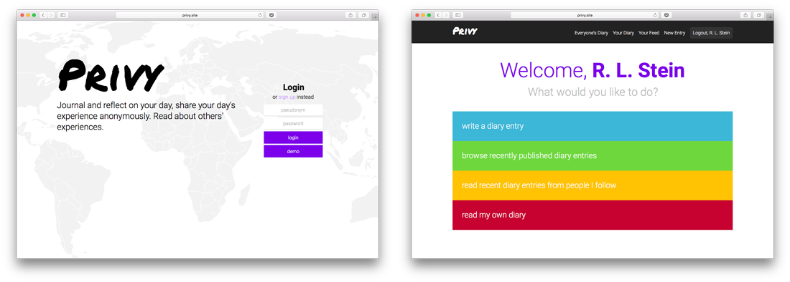
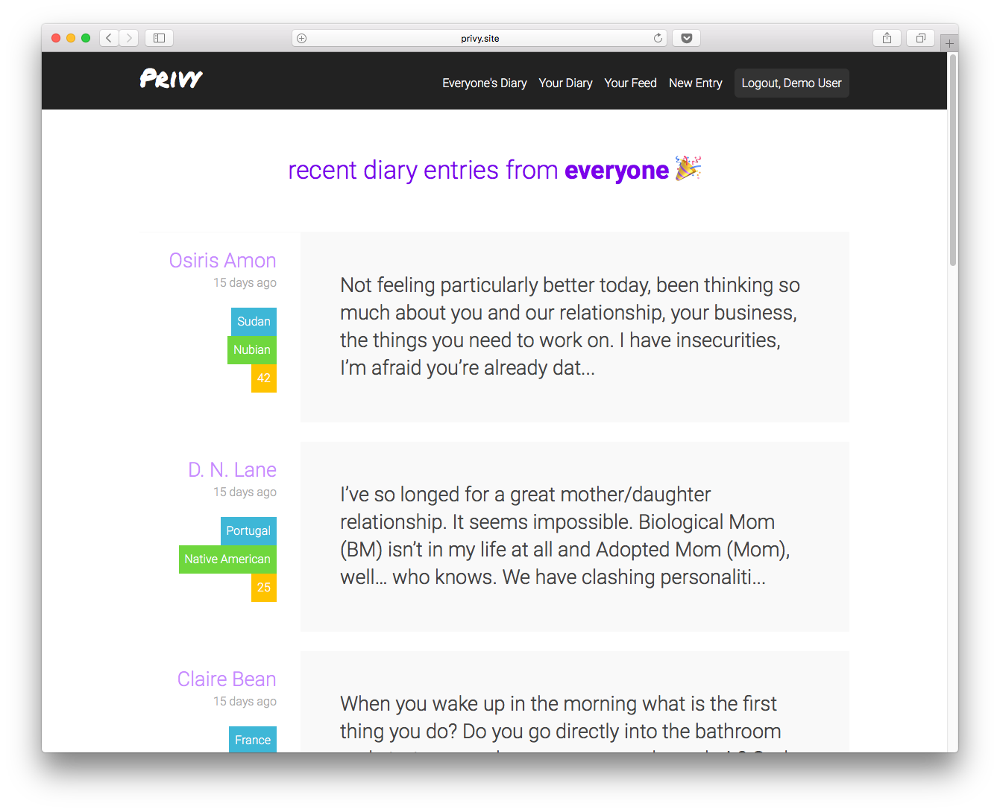

# Privy 
[Privy][live-link] is a single page application that lets users publish an anonymous diary under a pseudonym.  The app has a full-stack implementation: frontend views are handled with React and Redux. The backend utilizes a Rails framework to render and send data from a Postgres database to the frontend.


## Features
  * Secure account login authentication and creation: passwords are hashed and salted via BCrypt on the backend, additional protection reinforced on the frontend via protected auth routes
  * Users can follow and read other people’s diaries
  * Users can save and bookmarks diary entries they find meaningful
  * Users can read through their old entries and post a reflection entry they’ve written. Other users can read an entry’s reflections, but they cannot write a reflection on entries they haven’t written. 

 ### Login and Greeting page
  

 ### Viewing posts
  
To maintain DRY code, the same React component was used to render three different index views: the personal feed (showing entries based on a user's followers), the others users' entries (all entries writen by one user), the uer's own entries.

This was made possible by checking the URL pathname and params passed from the router and dynamically fetching content based on those specific props. 
```js
  componentWillReceiveProps(nextProps) {
    const { username, fetchEntries, fetchFeedEntries, currentUser, pathname } = nextProps;
    window.scrollTo(0, 0);

    if (this.props.pathname !== pathname ) {
      if (pathname === '/feed') {
        return fetchFeedEntries(currentUser.id) 
      } else if (username) {
        return fetchEntries(username);
      }
      return fetchEntries();
    }
  }

  typeOfIndexPage() {
    const { username, pathname } = this.props; 
    if (username) {
      return ` ${username}`;
    } else if (pathname === '/everyone') {
      return ' everyone';
    } 
    return ' people you follow';
  }
``` 

 ### Viewing a post
  
Utilizing SASS and its ability to create mixins also helped maintain DRY code for visual consistency and styling.  

## Project Design
Privy was designed and built in a two week period. View the original [proposal][dev-readme], which includes MVP features, an implementation timeline, and more extensive documentation.

## Future Implementations
### Feature implementations
  * User profiles to show general demographic information about the writers
  * Ability to search and read diaries from a general demographic, e.g. Italian women in their 40’s living in South Africa
  * The ability to highlight and save snippets of text users related to

### Technical Implementations
  * Adding unit, integration, and end-to-end tests
  * Utilize more CSS animations to create a smoother user experience

  [live-link]: https://privy-journal.herokuapp.com
  [dev-readme]: docs/README.md